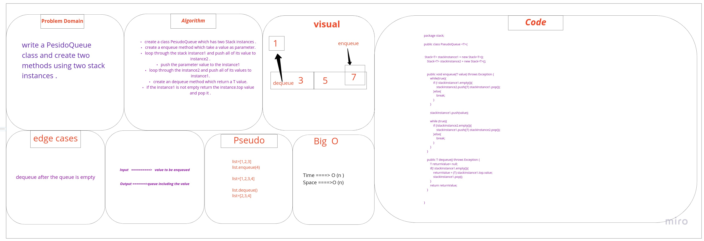
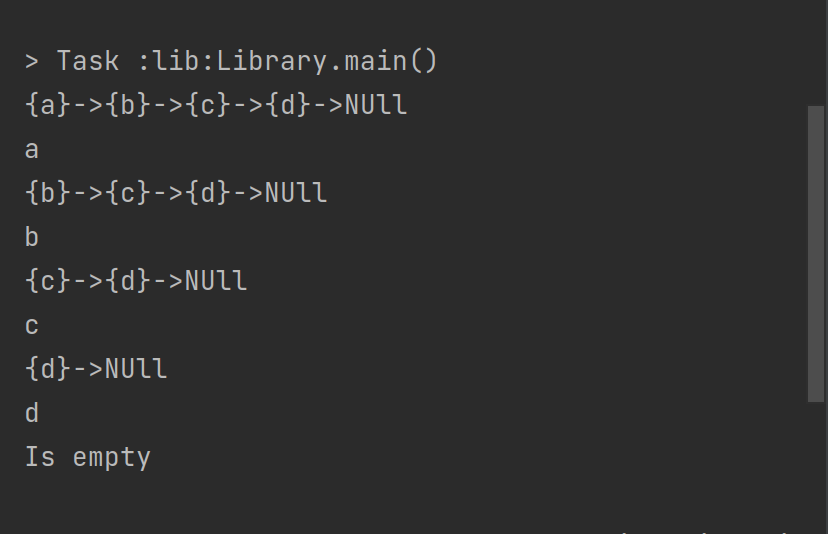

# Challenge Summary
create a PseudoQueue class and create two instances from Stack .
* create two methods (enqueue , dequeue)

## Whiteboard Process


## Approach & Efficiency

* the enqueue method :
 time= O(n)
 space = O(n)

* the dequeue method :
time= O(1)
 space = O(1)
## Solution

code example:

```
 PseudoQueue<String> pseudoTest = new PseudoQueue<String>();

        pseudoTest.enqueue("a");
        pseudoTest.enqueue("b");
        pseudoTest.enqueue("c");
        pseudoTest.enqueue("d");


        System.out.println(pseudoTest.stackInstance1.toString());
        System.out.println(pseudoTest.dequeue());
        System.out.println(pseudoTest.stackInstance1.toString());
        System.out.println(pseudoTest.dequeue());
        System.out.println(pseudoTest.stackInstance1.toString());
        System.out.println(pseudoTest.dequeue());
        System.out.println(pseudoTest.stackInstance1.toString());
        System.out.println(pseudoTest.dequeue());
        System.out.println(pseudoTest.stackInstance1.toString());
```

output:

