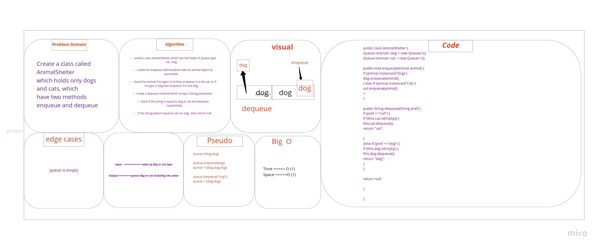

# Challenge Summary

Create a class called AnimalShelter
which holds only dogs and cats, which
have two methods enqueue and dequeue .

## Whiteboard Process

## Approach & Efficiency

# time O(1)
# space O(1)

## Solution


```
  AnimalShelter newCat = new AnimalShelter();
        Animal animal = new Cat();
        newCat.enqueue(animal);
        System.out.println(newCat.dequeue("cat"));
        System.out.println(newCat.dequeue("cat"));
```

output:
