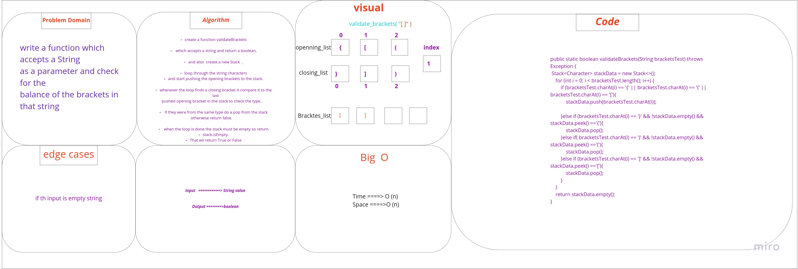
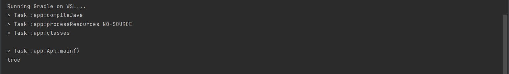

# Challenge Summary
we need to create a function accepts a string as parameter and check for the balance of the brackets in it.
## Whiteboard Process


## Approach & Efficiency

* Time = O(n)
* space = O(n)
## Solution
this an example of how to run the code :

```
 String bracketsTest = "()[[Extra Characters]]";

        System.out.println(validateBrackets(bracketsTest));

```

and here is its output :


